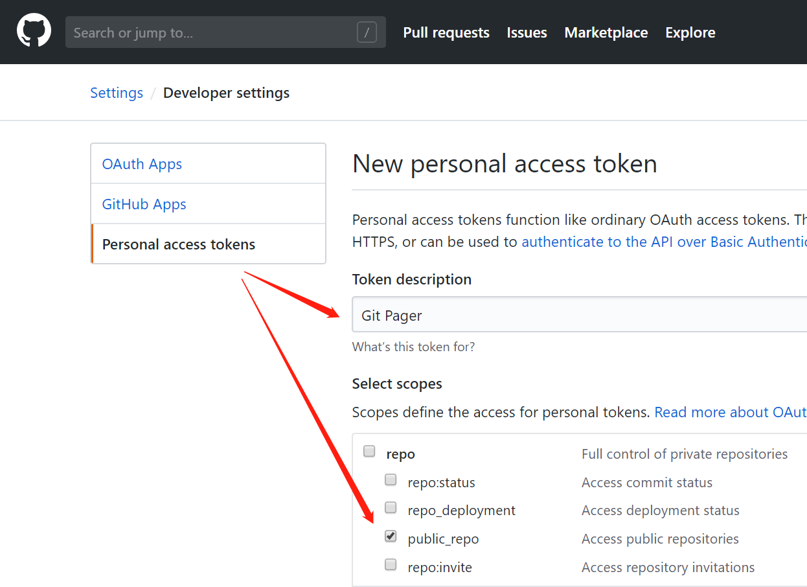

# Git Pager

[GitHub Pages](https://pages.github.com/) editor based on [WebCell](https://web-cell.tk/)

## Usage

First, create a [Personal access token](https://github.com/settings/tokens/new) of GitHub:

then, sign in https://web-cell.tk/git-pager/ with this token.

## Custom template

First, create [a Static Web page with an `<article />`](https://github.com/EasyWebApp/git-pager/blob/master/template/bootstrap%403.html#L69) in your Web server;

then, paste the URL of this Template file into _Article template_ input box.
